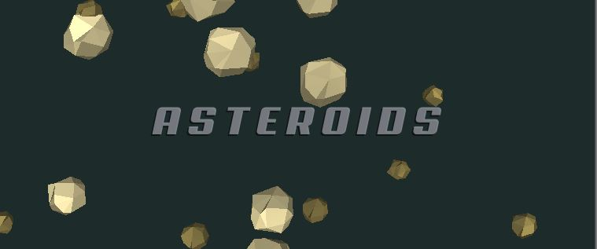

# Unity 3D Asteroids
#### _A simple Asteroids game clone in 3D. Stuck on a 2D plane. So 2.5D?_

:ant: Learning & Experimenting with Unity. Trying to determine best practices. :ant:

#### Design Choices
* Architecture/Frameworks: God Objects, MVC, IoC+DI, Messaging, Events, ...
* Software Patterns: OOP, Composition, Singletons, Object Pooling, Observer, ...
* [Game Programming Patterns](http://gameprogrammingpatterns.com/contents.html)
* Composition vs. OOP : Interfaces + Inheritance vs. Object Composition via Components
* MonoBehaviour + Extensions
* Serialization
* Idioms: One vs. Many
* Events: C# Delegate Events vs. UnityEvents
* Coroutines
* Optimizations

#### Workflow Choices
* Overall process: [The clubs.](https://en.wikipedia.org/wiki/List_of_software_development_philosophies)
* [Now choose a club...](https://www.youtube.com/watch?v=ac9Z6CN14Gs)
* You have chosen [Cowboy coding.](https://en.wikipedia.org/wiki/Cowboy_coding)
* May I suggest a [Methodology?](https://en.wikipedia.org/wiki/Software_development_process)
* Prefab use & referencing (editor vs. code)
* Quick Prototyping vs. Robustness
* Scene/Asset structure
* Profiling/Testing/Debugging
* IDE choice [(Visual Studio 2015 Community)](https://www.visualstudio.com/en-us/downloads/download-visual-studio-vs.aspx)
* Source code management(Git + GitHub + [GitHub VS2015 Extension](https://visualstudio.github.com/))
* Git: Commit, Sync, Push/Pull, Fork, Branch(Merge/Rebase), Revert
* GitHub: Repositories, Issues, Wiki, Markdown, Collaboration
* Blender Exporting

#### Unity Quirks
* Editor/Customization
* Interface
* Hacks/Tricks

#### [Check the Wiki for discussions](https://github.com/antfarmar/Unity-3D-Asteroids/wiki)
* Interesting things learned about Unity
* Software Engineering lessons learned
* Game design & development lessons learned
  
#### [Check Issues for interesting issues encountered](https://github.com/antfarmar/Unity-3D-Asteroids/issues)

##### Chat Room: 
